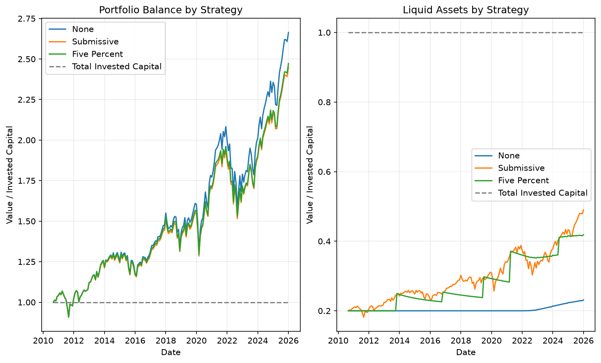

# Stock Portfolio

주식 포트폴리오를 과거 데이터로 시뮬레이션하는 실험 프로젝트입니다.

## 프로젝트 소개

- `yfinance`로 과거 주가 데이터를 가져옵니다.
- VOO, VXUS, SGOV 조합을 기준으로 월별 적립식 투자를 시뮬레이션합니다.
- 리밸런싱 전략별 포트폴리오 성과를 비교합니다.
- 전략별 평가표와 비교 그래프를 저장합니다.

## 실행 환경

- Python 3.14 이상
- `uv` 사용 권장

## 설치 방법

```bash
uv sync
```

가상환경을 직접 쓰는 경우에는 활성화한 뒤 `pyproject.toml` 기준으로 의존성을 설치하면 됩니다.

## 실행 방법

### 포트폴리오 시뮬레이션

```bash
uv run python main.py
```

이 명령은 전략별 평가표를 출력하고, 비교 이미지를 `strategy_comparison.png`로 저장합니다.

종목 조합, 목표 비율, 저장 파일 뒤에 붙일 별칭도 바로 넣을 수 있습니다.

```bash
uv run python main.py --tickers VOO,VXUS,TLT --portfolio-ratio 0.3,0.1,0.1 --output-suffix core
```

이 경우 결과 파일은 `strategy_summary_core.csv`, `strategy_comparison_core.png`처럼 저장됩니다.

## 결과 예시

아래는 프로젝트에서 생성된 예시 이미지입니다.



## 출력 지표

전략별 평가표에는 아래 지표가 포함됩니다.

- `total_return_pct`: 전체 기간 총수익률
- `annualized_return_pct`: 연환산 수익률
- `annualized_volatility_pct`: 연환산 변동성
- `max_drawdown_pct`: 최대낙폭
- `worst_1m_return_pct`: 최악 1개월 수익률
- `worst_3m_return_pct`: 최악 3개월 수익률
- `sharpe_ratio`: 샤프비

그래프는 다음 두 가지를 비교합니다.

- 전략별 전체 포트폴리오 가치
- 전략별 현금성 자산 비중

## 프로젝트 구조

```text
main.py
financial_fetch.py
example.png
pyproject.toml
README.md
```

## 참고

- 스크립트는 GUI 창을 띄우지 않고 이미지를 파일로 저장합니다.
- 그래프 폰트는 시스템 기본값을 사용하므로, 환경에 따라 미세한 차이는 있을 수 있습니다.
